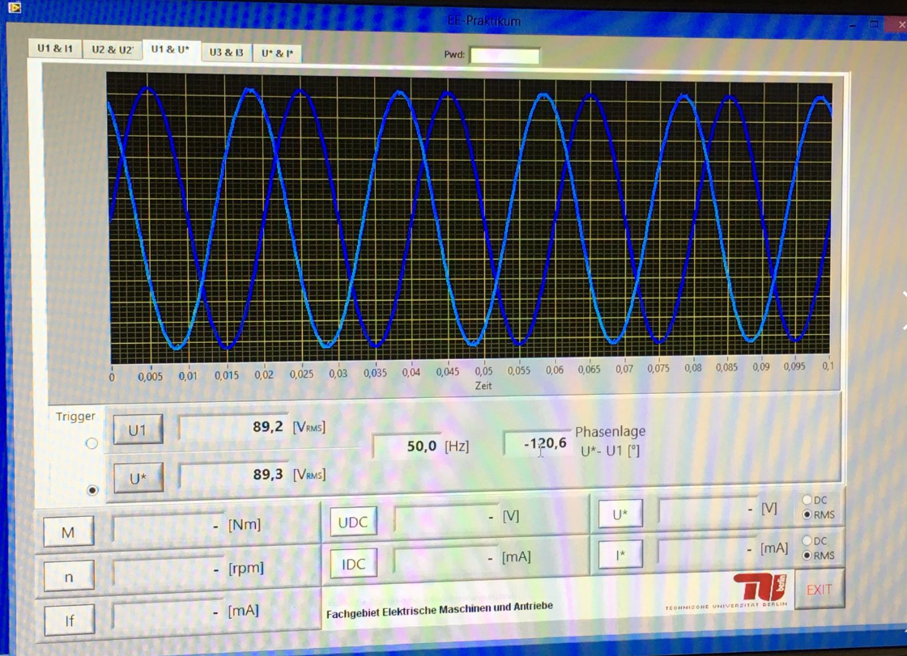

# Elektrische-Energiesysteme

## Inhalt

Dieses Repository basiert auf dem Kurs [„Elektrische Energiesysteme“](https://moseskonto.tu-berlin.de/moses/modultransfersystem/bolognamodule/beschreibung/anzeigen.html?number=40431&version=10) an der Technischen Universität Berlin.  

Ziel ist es die grundlegenden Funktionen der elektrischen Energieerzeugung und -verteilung kennenzulernen. Dazu wurden 4 Pratikas absolviert jeweils für die Themen:

- Praktika 1: Leistungselektronik
- Praktika 2: Gleichstrommaschine
- Praktika 3: Drehstrom und Transformator
- Praktika 4: Batterie

Im Folgenden werden die Inhalte der Praktikumstermine genauer erläutert.

## Vorwort

Neben den Grundlagen der Energieerzeugung und -verteilung werden auch Themen wie gesellschaftliche Verantwortung, Nachhaltigkeit, Energieersparung, Energiewende, Vermeidung von CO₂-Emissionen und nachhaltiger Materialeinsatz besprochen. Im Praktikum werden die theoretischen Inhalte durch Messungen an realen Systemen vertieft.

### Praktikum 1 - Leistungselektronik

Im ersten Praktikum wurde die Funktionsweise und die Eigenschaften eines Tiefsetzstellers untersucht. Dabei wurden ausgehend vom stationären Steuergesetz, den Spannungsverläufen der einzelnen Bauelemente, den Stromschwankungen und der Lückgrenze die Grundlagen zunächst theoretisch erklärt und anschließend experimentell mit dem Oszilloskop überprüft.

Der Tiefsetzsteller wird mit einer Eingangsspannung Uₑ (Gleichspannung) betrieben und wandelt diese in eine niedrigere Ausgangsspannung Uₐ (Gleichspannung) um. Er wird unter anderem in Netzteilen zum Laden von Batterien verwendet.

Weiterhin wurde bei diesem Versuch eine Ansteuerungsplatine verwendet, um einen Schalter zu simulieren. Die Platine diente vor allem zur Umwandlung eines Triggersignals in ein Rechtecksignal. Dabei wurden insbesondere die Steuerbarkeit über den Tastgrad D untersucht und veranschaulicht.

Das Ziel war dabei, die theoretischen Grundlagen zu überprüfen und die hergeleiteten Zusammenhänge experimentell zu validieren.

Das Protkoll zu dem Versuch ist unter diesem Link verfügbar: 
[Google Drive](https://drive.google.com/file/d/1jU600aZl7mM0IoyZ5uTvy-C3moWVB_IL/view?usp=sharing)

Einige Bilder des Praktikums sind in den folgenden Darstellungen aufgeführt:

#### Tiefsatzsteller (Draufsicht & Seitenansicht)

|  |  | 
| :------------------------------------------------------------------: | :----------------------------------------------------------------: |

#### Ansteuerungsplatine (Draufsicht & Seitenansicht)

|  |  | 
| :-------------------------------------------------------------------: | :-------------------------------------------------------------------: |

### Praktikum 2 - Gleichstrommaschine

Im zweiten Praktikum wurden die Funktionsweise und Eigenschaften der Gleichstrommaschine untersucht. Die Gleichstrommaschine, auch Kommutatormaschine genannt, ist eine rotierende elektrische Maschine. Sie kann sowohl als Generator als auch als Motor betrieben werden.

Heutzutage sind Gleichstrommaschinen in vielen Anwendungsgebieten wiederzufinden, da sie keine externe Leistungselektronik benötigen und damit günstiger als Drehstrommaschinen sein können. Beispiele dafür sind ferngesteuerte Fahrzeuge sowie Schrittmotoren in Robotern und Druckern.

Ausgehend von den Begriffen Drehmoment, Drehzahl, Maschinenkonstante, Kennliniengleichung, Wirkungsgrad sowie möglichen Verlusten wurden die Grundlagen zunächst theoretisch erklärt. Anschließend wurden experimentell die Widerstände sowie die Leerlauf- und Betriebskennlinie ermittelt und berechnet.

Das Ziel war dabei, die besprochene Theorie zu überprüfen und die hergeleiteten Zusammenhänge experimentell zu untersuchen.

Das Protkoll zu dem Versuch ist unter diesem Link verfügbar: 
[Google Drive](https://drive.google.com/file/d/1rSgVxS22lOZK47A81i7p40OmSy7ln_jG/view?usp=sharing)

Einige Bilder des Praktikums sind in den folgenden Darstellungen aufgeführt:

#### Gleichstrommaschine                    

|  | 
| :------------------------------------------------------------------: |

#### Aufbau zur Ermittlung der Ankerspannung

|   
| :-------------------------------------------------------------------: | 

### Praktikum 3 - Drehstrom und Transformator

Im dritten Praktikum wurden die Funktionsweise und die Eigenschaften eines dreiphasigen Transformators untersucht. Ein Transformator dient zur Umwandlung elektrischer Spannungen, also zur Einspeisung elektrischer Energie aus einem Stromnetz mit höherer Spannung in ein Netz mit niedrigerer Spannung. Dies wird mithilfe von Spannungs-Transformatoren realisiert.

Heute sind Transformatoren essenzielle Bauelemente in der elektrischen Energieversorgung. Sie werden beispielsweise für den Transport elektrischer Energie in Hochspannungsleitungen eingesetzt. Da die Kopplung durch eine galvanische Trennung erfolgt, finden Transformatoren auch in der Leistungselektronik Anwendung, insbesondere zur Potentialtrennung.

Ausgehend von den Leistungsformeln, dem Wirkungsgrad, der Dreieck- und Sternschaltung sowie den Kurzschluss- und Leerlaufversuchen wurden die theoretischen Grundlagen zunächst erläutert. Anschließend wurden experimentell die Schaltgruppenkennzahl, die erforderlichen Ersatzschaltbildparameter und die Leistungen bestimmt. 

Ziel war es insbesondere, die theoretischen Überlegungen zu überprüfen und die hergeleiteten Zusammenhänge experimentell zu untersuchen.

Das Protkoll zu dem Versuch ist unter diesem Link verfügbar: 
[Google Drive](https://drive.google.com/file/d/1M1Fz9_vQcUPfziipnxepz21lvI8sEQFt/view?usp=sharing)

Einige Ergebnisse sind in den folgenden Darstellungen aufgeführt:

#### Transformator mit Anschlussstellen für die Primär- und Sekundärseite

|  | 
| :------------------------------------------------------------------: |

#### Aufnahme Spannung, Ströme und Phasenwinkel mit Oszillogrammfenster einer Messsoftware

|  | 
| :------------------------------------------------------------------: |

### Praktikum 4 - Batterie

Im dritten Praktikum wurden die Funktionsweise und die Eigenschaften eines Lithium-Ionen-Akkumulators untersucht. Dieser dient der Speicherung elektrischer Energie, was beispielsweise in diversen mobilen Endgeräten wie Laptops und Mobiltelefonen Anwendung findet. Akkumulatoren werden aber auch stationär genutzt, unter anderem als Zwischenspeicher für Wind- und Solarenergieanlagen. Dadurch wird die Energieversorgung in Zeiträumen gesichert, in denen Solar- und Windanlagen keine oder nur wenig Energie liefern.

Das Protkoll zu dem Versuch ist unter diesem Link verfügbar: 
[Google Drive](https://drive.google.com/file/d/1TnIrm9CvTk6CcS65H3k5A1AaY5hNZYhq/view?usp=sharing)

Einige Ergebnisse sind in den folgenden Darstellungen aufgeführt:

#### Versuchsaufbau Entladung eines Lithium-Ionen-Akkumulators

|  | 
| :------------------------------------------------------------------: |

#### Spannungsverläufe Tiefsetzsteller mit Last R

|  | 
| :------------------------------------------------------------------: |
